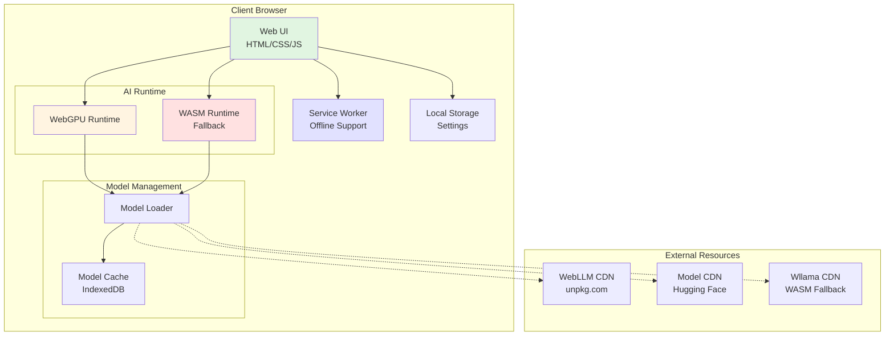
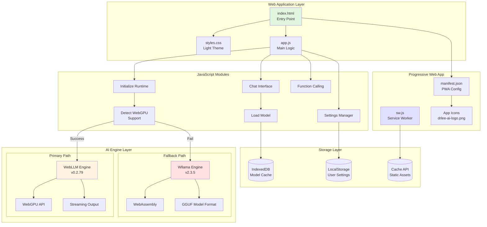
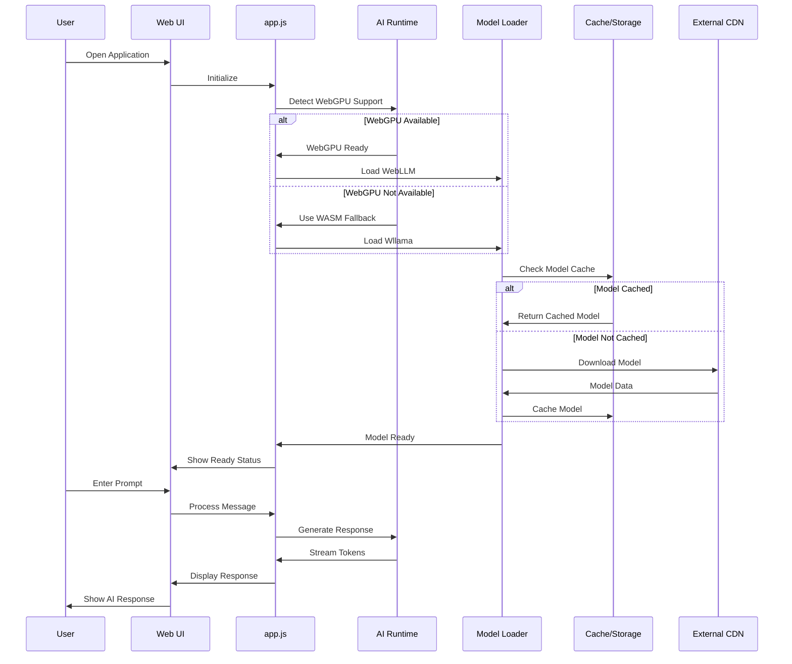
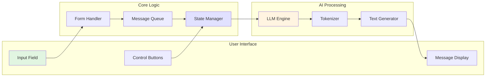
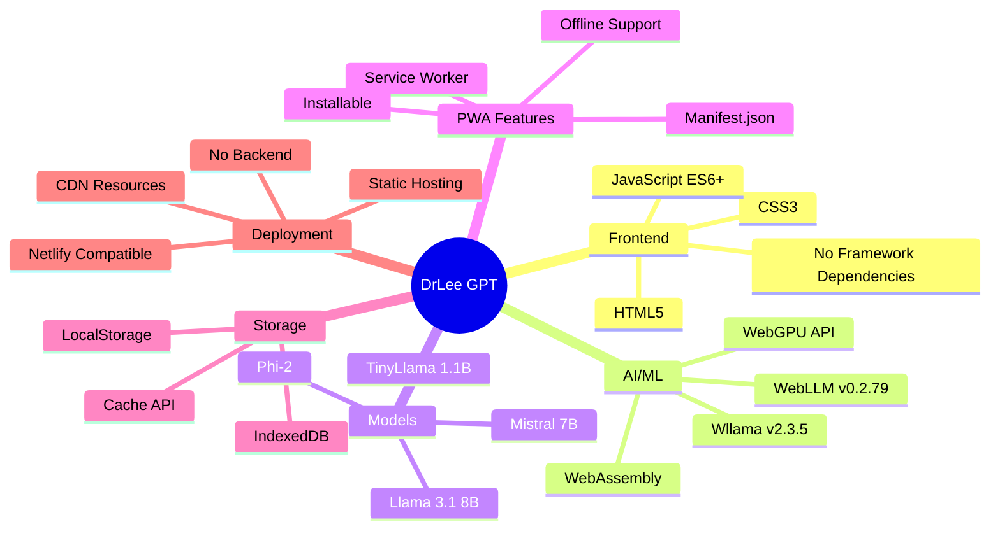

# DrLee GPT Architecture Diagrams

## High-Level Architecture

```mermaid
graph TB
    subgraph "Client Browser"
        UI[Web UI<br/>HTML/CSS/JS]
        
        subgraph "AI Runtime"
            WG[WebGPU Runtime]
            WA[WASM Runtime<br/>Fallback]
        end
        
        subgraph "Model Management"
            ML[Model Loader]
            MC[Model Cache<br/>IndexedDB]
        end
        
        SW[Service Worker<br/>Offline Support]
        LS[Local Storage<br/>Settings]
    end
    
    subgraph "External Resources"
        CDN1[WebLLM CDN<br/>unpkg.com]
        CDN2[Model CDN<br/>Hugging Face]
        CDN3[Wllama CDN<br/>WASM Fallback]
    end
    
    UI --> WG
    UI --> WA
    WG --> ML
    WA --> ML
    ML --> MC
    UI --> SW
    UI --> LS
    
    ML -.-> CDN1
    ML -.-> CDN2
    ML -.-> CDN3
    
    style UI fill:#e1f5e1
    style WG fill:#fff4e1
    style WA fill:#ffe1e1
    style SW fill:#e1e1ff
```

## Low-Level Architecture

```mermaid
graph TD
    subgraph "Web Application Layer"
        HTML[index.html<br/>Entry Point]
        CSS[styles.css<br/>Light Theme]
        APP[app.js<br/>Main Logic]
        
        HTML --> CSS
        HTML --> APP
    end
    
    subgraph "JavaScript Modules"
        INIT[Initialize Runtime]
        DETECT[Detect WebGPU<br/>Support]
        LOAD[Load Model]
        CHAT[Chat Interface]
        TOOL[Function Calling]
        SETTINGS[Settings Manager]
    end
    
    subgraph "AI Engine Layer"
        subgraph "Primary Path"
            WEBLLM[WebLLM Engine<br/>v0.2.79]
            WEBGPU[WebGPU API]
            STREAM[Streaming Output]
        end
        
        subgraph "Fallback Path"
            WLLAMA[Wllama Engine<br/>v2.3.5]
            WASM[WebAssembly]
            GGUF[GGUF Model Format]
        end
    end
    
    subgraph "Storage Layer"
        IDB[(IndexedDB<br/>Model Cache)]
        LOCAL[(LocalStorage<br/>User Settings)]
        CACHE[(Cache API<br/>Static Assets)]
    end
    
    subgraph "Progressive Web App"
        MANIFEST[manifest.json<br/>PWA Config]
        SERVICEW[sw.js<br/>Service Worker]
        ICONS[App Icons<br/>drlee-ai-logo.png]
    end
    
    APP --> INIT
    INIT --> DETECT
    DETECT -->|Success| WEBLLM
    DETECT -->|Fail| WLLAMA
    
    WEBLLM --> WEBGPU
    WEBLLM --> STREAM
    WLLAMA --> WASM
    WLLAMA --> GGUF
    
    APP --> CHAT
    APP --> TOOL
    APP --> SETTINGS
    
    CHAT --> LOAD
    LOAD --> IDB
    SETTINGS --> LOCAL
    
    SERVICEW --> CACHE
    HTML --> MANIFEST
    MANIFEST --> ICONS
    
    style HTML fill:#e1f5e1
    style WEBLLM fill:#fff4e1
    style WLLAMA fill:#ffe1e1
    style SERVICEW fill:#e1e1ff
```

## Data Flow Diagram

```mermaid
sequenceDiagram
    participant User
    participant UI as Web UI
    participant App as app.js
    participant Runtime as AI Runtime
    participant Model as Model Loader
    participant Cache as Cache/Storage
    participant CDN as External CDN
    
    User->>UI: Open Application
    UI->>App: Initialize
    App->>Runtime: Detect WebGPU Support
    
    alt WebGPU Available
        Runtime->>App: WebGPU Ready
        App->>Model: Load WebLLM
    else WebGPU Not Available
        Runtime->>App: Use WASM Fallback
        App->>Model: Load Wllama
    end
    
    Model->>Cache: Check Model Cache
    
    alt Model Cached
        Cache->>Model: Return Cached Model
    else Model Not Cached
        Model->>CDN: Download Model
        CDN->>Model: Model Data
        Model->>Cache: Cache Model
    end
    
    Model->>App: Model Ready
    App->>UI: Show Ready Status
    
    User->>UI: Enter Prompt
    UI->>App: Process Message
    App->>Runtime: Generate Response
    Runtime->>App: Stream Tokens
    App->>UI: Display Response
    UI->>User: Show AI Response
```

## Component Interaction

```mermaid
graph LR
    subgraph "User Interface"
        INPUT[Input Field]
        MSG[Message Display]
        BTN[Control Buttons]
    end
    
    subgraph "Core Logic"
        FORM[Form Handler]
        MSGQ[Message Queue]
        STATE[State Manager]
    end
    
    subgraph "AI Processing"
        ENGINE[LLM Engine]
        TOKENIZER[Tokenizer]
        GENERATOR[Text Generator]
    end
    
    INPUT --> FORM
    FORM --> MSGQ
    MSGQ --> STATE
    STATE --> ENGINE
    ENGINE --> TOKENIZER
    TOKENIZER --> GENERATOR
    GENERATOR --> MSG
    BTN --> STATE
    
    style INPUT fill:#e1f5e1
    style ENGINE fill:#fff4e1
    style STATE fill:#e1e1ff
```

## Technology Stack Overview

```mermaid
mindmap
  root((DrLee GPT))
    Frontend
      HTML5
      CSS3
      JavaScript ES6+
      No Framework Dependencies
    AI/ML
      WebLLM v0.2.79
      Wllama v2.3.5
      WebGPU API
      WebAssembly
    Models
      TinyLlama 1.1B
      Phi-2
      Mistral 7B
      Llama 3.1 8B
    PWA Features
      Service Worker
      Manifest.json
      Offline Support
      Installable
    Storage
      IndexedDB
      LocalStorage
      Cache API
    Deployment
      Static Hosting
      CDN Resources
      No Backend
      Netlify Compatible
```
